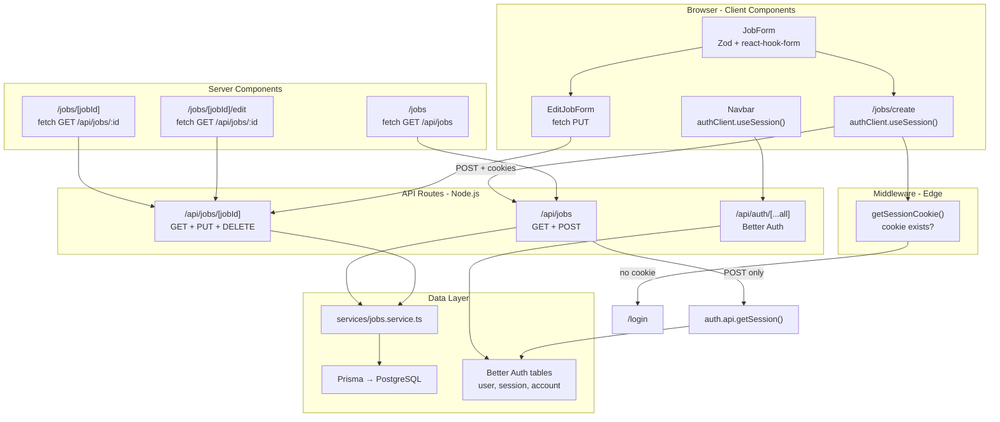

# FreelanceHub Jobs & Auth Architecture

How job APIs, pages, and sessions fit together in this app.

---

## High-level flow



---

## Job API routes

| Endpoint | Method | Auth required? | What it does |
|----------|--------|----------------|--------------|
| `/api/jobs` | `GET` | No | Lists all jobs (newest first), includes `client` user |
| `/api/jobs` | `POST` | **Yes** | Creates a job; `clientId` = logged-in user id |
| `/api/jobs/[jobId]` | `GET` | No | Single job + `client` + `applications` |
| `/api/jobs/[jobId]` | `PUT` | **No** (gap) | Updates title, description, budget |
| `/api/jobs/[jobId]` | `DELETE` | **No** (gap) | Deletes a job |

### `POST /api/jobs` flow

```
Request body
    ↓
createJobSchema (Zod) — title ≥5, description ≥20, budget ≥50
    ↓
auth.api.getSession({ headers: request.headers })
    ↓
createJob({ ...data, clientId: session.user.id })
    ↓
prisma.job.create()
```

### Request body (create / update)

```json
{
  "title": "Senior React Developer",
  "description": "At least twenty characters here...",
  "budget": 500
}
```

---

## Pages → API → what renders

| Page | Type | Fetches | Renders |
|------|------|---------|---------|
| `/jobs` | **Server** | `GET http://localhost:3000/api/jobs` | Job list (title, budget), link to each job, "Create Job" button |
| `/jobs/create` | **Client** | `POST /api/jobs` on submit | `JobForm`; redirects to `/login` if no session |
| `/jobs/[jobId]` | **Server** | `GET http://localhost:3000/api/jobs/{id}` | Title, description, budget, "Edit Job" link |
| `/jobs/[jobId]/edit` | **Server** + **Client** | Server: `GET /api/jobs/{id}` to prefill; Client: `PUT /api/jobs/{id}` on submit | `EditJobForm` → `JobForm` with defaults |

### Layout (every page)

`app/layout.tsx` wraps all pages with:

- `Navbar` (session-aware)
- `<main>{children}</main>`
- Footer

---

## Shared components

| Component | Role |
|-----------|------|
| `JobForm` | Form with Zod + react-hook-form; used for create and edit |
| `EditJobForm` | Client wrapper: loads defaults, calls `PUT /api/jobs/{id}` |
| `Navbar` | Shows user name + sign out, or Login / Register |

---

## Session & auth — 3 layers

### 1. Client (browser)

**File:** `lib/auth-client.ts`

```typescript
authClient.useSession()  // Navbar, /jobs/create
authClient.signIn.email()
authClient.signUp.email()
authClient.signOut()
```

- Calls `/api/auth/*` (Better Auth)
- Reads session from cookies automatically
- Used for UI only (show name, redirect if not logged in)

### 2. Middleware (Edge — cookie check only)

**File:** `middleware.ts`  
**Protects:** `/jobs/create`, `/dashboard/*`, `/messages/*`, `/profile/*`

```typescript
getSessionCookie(request)  // checks cookie exists, NOT full validation
```

- If no cookie → redirect to `/login`
- Does **not** hit the database (Edge can't use Prisma)
- Optimistic guard only

### 3. Server API (full session validation)

**File:** `lib/auth.ts` + `app/api/jobs/route.ts`

```typescript
const session = await auth.api.getSession({
  headers: request.headers,  // reads session cookie, validates against DB
})
```

- Used on `POST /api/jobs` only
- Returns `401` if not logged in
- Sets `clientId` from `session.user.id`

### Auth API (Better Auth)

**File:** `app/api/auth/[...all]/route.ts`

| Action | Endpoint |
|--------|----------|
| Register | `POST /api/auth/sign-up/email` |
| Login | `POST /api/auth/sign-in/email` |
| Get session | `GET /api/auth/get-session` |
| Sign out | `POST /api/auth/sign-out` |

**DB tables:** `user`, `session`, `account`, `verification` (Better Auth)  
**App table:** `Job.clientId` → `user.id`

---

## Data layer

```
app/api/jobs/route.ts
        ↓
services/jobs.service.ts
        ↓
lib/db.ts (PrismaClient)
        ↓
PostgreSQL
```

| Service function | Prisma call |
|------------------|-------------|
| `createJob` | `prisma.job.create` |
| `getJobs` | `prisma.job.findMany` + `client` |
| `getJobById` | `prisma.job.findUnique` + `client`, `applications` |
| `updateJob` | `prisma.job.update` |
| `deleteJob` | `prisma.job.delete` |

### Prisma `Job` model

```prisma
model Job {
  id           String        @id @default(cuid())
  title        String
  description  String
  budget       Int
  createdAt    DateTime      @default(now())
  clientId     String
  client       User          @relation(fields: [clientId], references: [id])
  applications Application[]
}
```

---

## Validation

**File:** `lib/validations/job.schema.ts`

| Field | Rule |
|-------|------|
| `title` | string, min 5 chars |
| `description` | string, min 20 chars |
| `budget` | number, min 50 |

Validated in:

1. **Client:** `JobForm` via `zodResolver`
2. **Server:** API routes via `createJobSchema.safeParse()`

API errors are formatted for the UI by `lib/format-api-error.ts`.

---

## End-to-end: create a job

```
1. User logs in at /login
   → POST /api/auth/sign-in/email
   → Session cookie set in browser

2. User visits /jobs/create
   → Middleware: getSessionCookie() ✓
   → Page: authClient.useSession() ✓
   → JobForm shown

3. User submits form
   → Zod validates client-side
   → POST /api/jobs (credentials: "include" sends cookie)
   → API: auth.api.getSession() → gets user id
   → API: Zod validates body
   → createJob({ title, description, budget, clientId })
   → Redirect to /jobs

4. /jobs page
   → Server fetch GET /api/jobs
   → Renders list including new job
```

---

## File map

| File | Purpose |
|------|---------|
| `app/api/jobs/route.ts` | `GET` list, `POST` create (auth required) |
| `app/api/jobs/[jobId]/route.ts` | `GET`, `PUT`, `DELETE` single job |
| `app/jobs/page.tsx` | Job listing page (server component) |
| `app/jobs/create/page.tsx` | Create job page (client component) |
| `app/jobs/[jobId]/page.tsx` | Job detail page (server component) |
| `app/jobs/[jobId]/edit/page.tsx` | Edit job page (server + client) |
| `components/JobForm.tsx` | Shared form with Zod validation |
| `components/EditJobForm.tsx` | Edit form wrapper with PUT fetch |
| `services/jobs.service.ts` | Prisma CRUD for jobs |
| `lib/validations/job.schema.ts` | Zod schema for job fields |
| `lib/auth.ts` | Better Auth server config |
| `lib/auth-client.ts` | Better Auth React client |
| `middleware.ts` | Cookie-based route protection |
| `app/api/auth/[...all]/route.ts` | Better Auth API handler |

---

## Gaps to be aware of

| Issue | Detail |
|-------|--------|
| **PUT/DELETE not protected** | Anyone can update/delete any job; no session check on `[jobId]` routes |
| **No ownership check** | Create uses your user id, but edit/delete don't verify you own the job |
| **Hardcoded API URL** | `/jobs` and `/jobs/[jobId]` use `http://localhost:3000` — breaks in production |
| **GET /api/jobs is public** | Listing and detail don't require login (by design for now) |

---

## Quick reference

```
Pages (UI)                    API (data)                    Auth
─────────────────────────────────────────────────────────────────────
/jobs                    →    GET  /api/jobs                 none
/jobs/create             →    POST /api/jobs                 session required
/jobs/[id]               →    GET  /api/jobs/[id]            none
/jobs/[id]/edit          →    GET  /api/jobs/[id]            none (page)
                         →    PUT  /api/jobs/[id]            none (API)
/login                   →    POST /api/auth/sign-in/email
/register                →    POST /api/auth/sign-up/email
Navbar                   →    GET  /api/auth/get-session (via useSession)
```

---

## Testing APIs with curl

**Sign in and save cookie:**

```bash
curl -c cookies.txt -X POST http://localhost:3000/api/auth/sign-in/email \
  -H "Content-Type: application/json" \
  -d '{"email":"your@email.com","password":"yourpassword"}'
```

**Create job (authenticated):**

```bash
curl -b cookies.txt -X POST http://localhost:3000/api/jobs \
  -H "Content-Type: application/json" \
  -d '{"title":"Senior React Developer","description":"Build and maintain our freelance marketplace frontend","budget":500}'
```

**List jobs (public):**

```bash
curl http://localhost:3000/api/jobs
```
